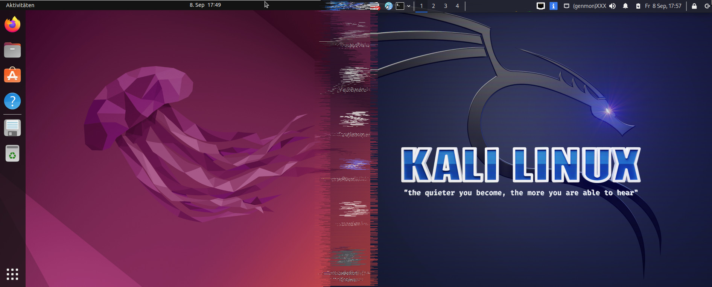

# Kali-theme on Ubuntu (+ switch to XFCE4)

This script will install several components of Kali to make a default Ubuntu-installation look like Kali.
All rights belong to their respective owners.

## Why would you want that?

If you like the Kali-theme (and XFCE4) as your daily driver, but want to use the default Ubuntu packages and repos, this is for you.

## Usage

Note: This script is not perfect, but it works.

Download the contents and place them inside an empty directory.
Now run `main.sh`.

## Nice-to-know

This script does not add a new apt-source or anything like that. But it downloads the original packages from the main kali-servers (or mirrors).
Those will be installed. Additional files will be pulled from the kali-themes GitLab-repo. It can happen that system-updates break these files.
Just run the script again in this case.

**IMPORTANT:** This removes most of GNOME-programs!

---

[MIT License](LICENSE)
